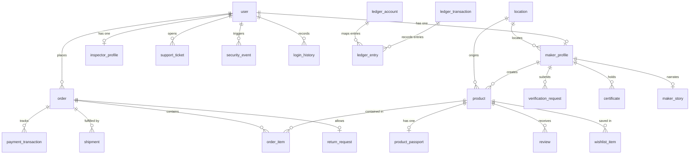
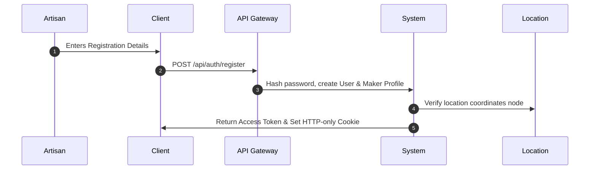
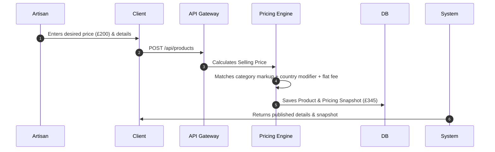
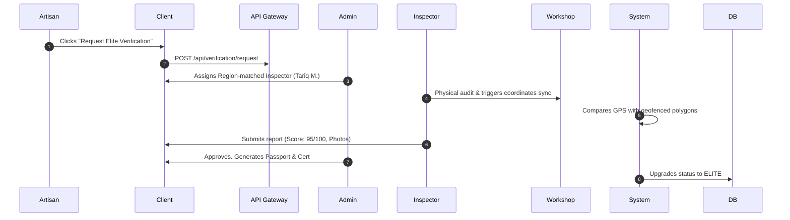
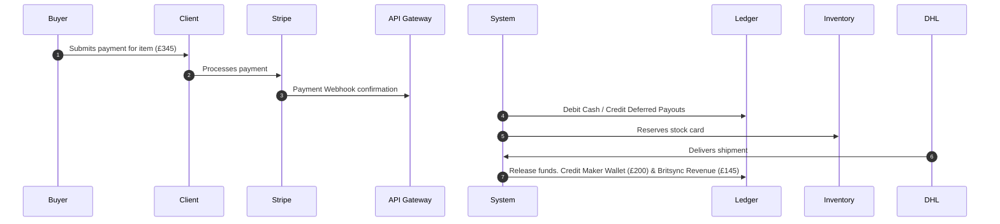

# 📜 Britsync Market — Complete Enterprise Architecture Specification & Blueprint

---

## 1. Executive Summary & Foundational Strategy

### 1.1 Executive Summary
Britsync is a managed global commerce platform designed to bridge the digital divide for master artisans, heritage creators, and Geographical Indication (GI) certified cooperatives. By abstracting 100% of transactional, technical, and operational complexity, Britsync enables makers to focus entirely on their craft. Britsync manages international payment routing, VAT compliance, customs clearings, dynamic margin pricing, storytelling curation, and high-fidelity logistics.

### 1.2 Vision & Mission
* **Vision:** A world where generational heritage and craftsmanship remain highly respected, financially viable livelihoods, unaffected by the barriers of digital trade and logistics.
* **Mission:** To establish the world's most trusted, operationally transparent managed commerce system connecting makers with patrons in the UK and Europe.

### 1.3 Platform Principles
```
┌───────────────────────────────────┐  ┌───────────────────────────────────┐
│       QUALITY over Quantity       │  │        STORY over Product         │
├───────────────────────────────────┤  ├───────────────────────────────────┤
│ Hand-curated, limited-run pieces. │  │ We do not list objects; we        │
│ No dropshipping or factories.     │  │ document heritage and time.       │
└───────────────────────────────────┘  └───────────────────────────────────┘
┌───────────────────────────────────┐  ┌───────────────────────────────────┐
│        TRUST over Price           │  │      PEOPLE over Technology       │
├───────────────────────────────────┤  ├───────────────────────────────────┤
│ Cryptographic origin passports    │  │ Technology is an invisible helper;│
│ and on-site physical GPS audits.  │  │ zero code required from creators. │
└───────────────────────────────────┘  └───────────────────────────────────┘
```

---

## 2. Global System Architecture Blueprint

Britsync splits read and write workloads using a Command Query Responsibility Segregation (CQRS) architecture, backed by a Transactional Outbox Pattern to maintain eventual consistency.

```
                                  SYSTEM ARCHITECTURE MAP
 
                 ┌────────────────────────────────────────────────────────┐
                 │                   Public Traffic (CDN)                 │
                 └──────────────────────────┬─────────────────────────────┘
                                            │
                                            ▼
                 ┌────────────────────────────────────────────────────────┐
                 │                API Gateway / Load Balancer             │
                 └──────┬──────────────────────────────────┬──────────────┘
                        │ (Write Path)                     │ (Read Path)
                        ▼                                  ▼
             ┌─────────────────────┐             ┌──────────────────┐
             │  PostgreSQL Master  │             │   Redis Cluster  │
             │   (Dublin Region)   │             │  (Session Cache) │
             └──────────┬──────────┘             └──────────────────┘
                        │                                  ▲
                        │ (Transactional Outbox events)    │ (In-memory sync)
                        ▼                                  │
             ┌─────────────────────┐             ┌─────────┴────────┐
             │ Outbox Message Bus  ├────────────►│  Elasticsearch   │
             │   (Kafka Worker)    │             │   Search Index   │
             └─────────────────────┘             └──────────────────┘
```

### 2.1 Core Architectural Components
* **CQRS (Command Query Responsibility Segregation):** Write operations are executed against a highly structured PostgreSQL instance. Read queries for products and maker biographies are served by Redis cache lines and Elasticsearch indexes.
* **Event Outbox Pattern:** To ensure transactional safety without distributed commits, commands write to an `event_outbox` table. A background poller reads these events and dispatches them to a Kafka event bus, updating Redis and Elasticsearch.
* **Geographical Sharding & Replication:** Primary write DB resides in EU-West (Dublin), replicated to regional read nodes in Asia-East (Singapore) to ensure sub-50ms catalog loading speeds.

---

## 3. Database Schema Specification (Version 3)

This section maps the complete production database schema. It utilizes lookup tables instead of native enums, double-entry financial ledgers, and GIST indexes on geographical `ltree` hierarchies.

### 3.1 Entity-Relationship Diagram (ERD)



### 3.2 Reference & Lookup Tables (ENUL replacements)
To prevent lockups during online schema migrations, enums are replaced with lookup tables:
1. **`user_role_lookup`:** Codes include `SUPER_ADMIN`, `ADMIN`, `INSPECTOR`, `BUYER`, `MAKER`, `FINANCE`, `STORY_TEAM`.
2. **`verification_tier_lookup`:** Codes include `GENERAL`, `VERIFIED`, `ELITE`, `GI`.
3. **`product_status_lookup`:** Codes include `DRAFT`, `PENDING_REVIEW`, `APPROVED`, `REJECTED`, `PUBLISHED`, `ARCHIVED`.
4. **`order_status_lookup`:** Codes include `PENDING`, `CONFIRMED`, `SHIPPED`, `DELIVERED`, `COMPLETED`, `DISPUTED`, `REFUNDED`, `CANCELLED`.

### 3.3 Core Database Tables

#### 3.3.1 `location` Table
* **Purpose:** Hierarchical geographical database using `ltree` structure. Supports single-query subtree lookups.
* **Fields:**
  * `id` UUID Primary Key.
  * `parent_id` UUID Foreign Key to `location(id)`.
  * `path` `ltree` (e.g., `globe.europe.uk.england`).
  * `location_type` VARCHAR(50) ('CONTINENT', 'COUNTRY', 'REGION', 'PROVINCE', 'CITY', 'VILLAGE').
  * `gps_coordinates` GEOMETRY(Point, 4326).
* **Indexes:** `idx_location_path_gist` USING GIST over `path`.

#### 3.3.2 `product` Table
* **Purpose:** Core table for product metadata. Keeps only numerical desired price and foreign keys. Details are stored in `product_translation`.
* **Fields:**
  * `id` UUID Primary Key.
  * `maker_profile_id` UUID Foreign Key to `maker_profile(id)`.
  * `category_id` UUID Foreign Key to `category(id)`.
  * `location_id` UUID Foreign Key to `location(id)` (pointing to specific village).
  * `desired_price` NUMERIC(12, 2) NOT NULL (Artisan target payout).
  * `verification_status` VARCHAR(50) NOT NULL References `verification_tier_lookup(code)`.
  * `status` VARCHAR(50) NOT NULL References `product_status_lookup(code)`.
  * `deleted_at` TIMESTAMP WITH TIME ZONE NULL (Soft delete).
* **Indexes:**
  * `uniq_product_sku_active` UNIQUE INDEX on `id` WHERE (`deleted_at IS NULL`).
  * `idx_product_status_publish` B-tree on `status` WHERE (`status = 'PUBLISHED'`).

#### 3.3.3 Double-Entry Ledger Schema
1. **`ledger_account`:** Holds account classifications (`ASSET`, `LIABILITY`, `REVENUE`, `EXPENSE`, `EQUITY`).
2. **`ledger_transaction`:** Groups entry debits and credits, mapped to an `idempotency_key` to prevent duplicate ledger postings.
3. **`ledger_entry`:** Standard debit/credit line table:
   * `amount_debit` NUMERIC(12, 2) NOT NULL DEFAULT 0.00.
   * `amount_credit` NUMERIC(12, 2) NOT NULL DEFAULT 0.00.
   * Check Constraint: `CHECK ((amount_debit > 0 AND amount_credit = 0) OR (amount_credit > 0 AND amount_debit = 0))`.

---

## 4. Authentication, Authorization & Security Architecture

### 4.1 Core Authentication Flow
* **Signup / Registration:** Handled over SSL. Passwords hashed using Argon2id. Automatically creates a user session token.
* **JWT & Refresh Tokens:** Access tokens expire in 15 minutes. Refresh tokens are stored in HTTP-Only, Secure, SameSite=Strict cookies, mapped in the database to prevent replay attacks.
* **MFA (Multi-Factor Authentication):** Enforced for Admin, CEO, and Finance roles using TOTP (Time-based One-time Password).

### 4.2 Security Safeguards
* **SQL Injection Prevention:** Every query utilizes parameterized queries through Prisma ORM. Direct raw queries are validated against SQL injection vectors using geographic coordinates parsing.
* **GDPR Compliance:** PII columns (e.g., name, phone) are encrypted at-rest using AES-256. IP addresses are hashed using SHA-256 before storage in logs.
* **Row-Level Security (RLS):** Policies isolate database query bounds using cached session parameters, preventing subquery lookup overheads.

---

## 5. End-to-End System Workflows

### 5.1 Registration & Profile Setup


### 5.2 Product Creation & Pricing Calculation


### 5.3 On-site Inspection & Elite Verification


### 5.4 Order Checkout & Payout Ledger


---

## 6. Developer, Quality & Deployment Guide

### 6.1 Folder Structure
```
d:/store/
├── docs/
│   ├── founder_bible.md       # Strategic roadmap and vision
│   ├── prd.md                 # Product requirements document
│   ├── ops_manual.md          # Standard operating procedures
│   └── database_architecture.md # Version 3 DB DDL and RLS specification
├── prisma/
│   ├── schema.prisma          # Prisma mapping file
│   └── seed.js                # Database seeds
├── src/
│   ├── app/                   # Public routes & role dashboard portals
│   ├── components/            # UI components (Nova AI chatbot)
│   ├── lib/                   # Security, session, pricing utilities
│   └── services/              # Core business services (AI, search, ledger)
├── package.json               # Node packages and build scripts
└── README.md                  # This master specification
```

### 6.2 Installation & Local Setup
1. **Initialize Prerequisites:**
   * PostgreSQL 16 (with PostGIS and ltree enabled).
   * Redis.
2. **Install node dependencies:**
   ```bash
   npm install
   ```
3. **Run database setup:**
   ```bash
   npx prisma db push
   ```
4. **Seed database values:**
   ```bash
   node prisma/seed.js
   node prisma/seed_inspectors.js
   ```
5. **Run the development server:**
   ```bash
   npm run dev
   ```

### 6.3 DevOps, CI/CD & Deployment
* **GitHub Actions:** Automatically runs tests, checks lint standards, and builds the Next.js bundle on every push to `main`.
* **Blue-Green Deployments:** Production builds are deployed using blue-green models on AWS ECS or GCP GKE clusters, preventing downtime during release cycles.
* **Point-in-Time Recovery (PITR):** WAL files are archived to GCS buckets every 15 minutes, allowing database restoration to any millisecond state.

---

*This document serves as the master blueprint and single source of truth for the Britsync Market system.*
