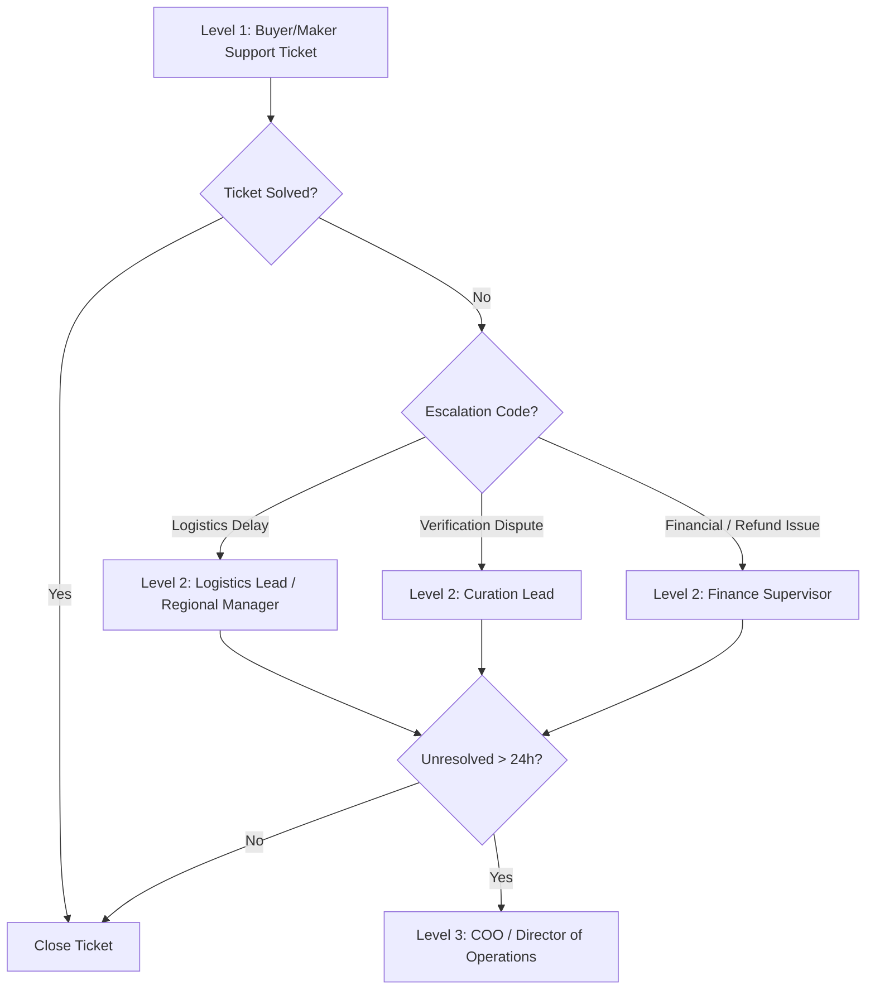
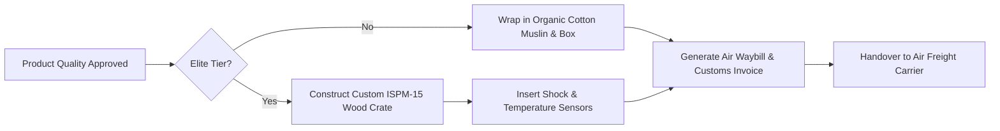

# 📖 Britsync Operations Manual (Standard Operating Procedures - SOP)

---

## Part 1 – Company Operations

### 1.1 Organizational Structure & Department Responsibilities
Britsync operates as a hub-and-spoke global managed commerce entity. Headquartered in London (UK), operations are executed through regional hubs (e.g., Britsync South Asia, Britsync Mediterranean, Britsync East Africa).

```
                            GLOBAL OPERATIONS ORG CHART
                     
                              ┌──────────────────────┐
                              │  Board of Directors  │
                              └──────────┬───────────┘
                                         │
                              ┌──────────┴───────────┐
                              │      CEO & COO       │
                              └──────────┬───────────┘
                                         │
         ┌──────────────┬────────────────┼──────────────┬──────────────┐
         ▼              ▼                ▼              ▼              ▼
   ┌───────────┐  ┌───────────┐    ┌───────────┐  ┌───────────┐  ┌───────────┐
   │ Story &   │  │ Curation  │    │ Global    │  │ Finance & │  │ Tech &    │
   │ Editorial │  │ & Auditing│    │ Logistics │  │ Escrow    │  │ Platform  │
   └───────────┘  └───────────┘    └───────────┘  └───────────┘  └───────────┘
```

* **Curation & Auditing Department:** Manages the network of regional Field Inspectors, schedules audits, performs business screening, and handles quality control.
* **Global Logistics Department:** Oversees export/import clearance, local carrier pickups, premium custom crating logistics, and tracking status sync.
* **Story & Editorial Department:** Transcribes field recordings, translates craft biographies, edits media assets, and publishes Maker profiles.
* **Finance & Escrow Department:** Governs the dynamic pricing engine overrides, manages currency conversions, and processes payouts via Wise or local banks.
* **Tech & Platform Department:** Maintains database operations, ensures security compliance, and supports the AI search models.

### 1.2 Escalation Matrix (Global Support Escalation Model)


---

## Part 2 – Maker Operations

### 2.1 Maker Onboarding & Screening SOP
* **Purpose:** To verify the physical existence, traditional manufacturing techniques, and legal standing of applying artisans.
* **Responsible Department:** Curation & Auditing Department.
* **Inputs:** Raw application form (via Web, WhatsApp, or local partner NGO).
* **Outputs:** Active Maker profile and scheduled site inspection or application rejection.

#### Step-by-Step Workflow
1. **Screening Phase:** Verify identity using government-issued photo ID (passport, national identity card).
2. **Business Registration Search:** Cross-reference business name against regional trade registries or local municipal certificates.
3. **Materials Declaration Audit:** Confirm that at least 80% of materials are locally sourced and free from synthetic polymers.
4. **Lineage Check:** Verify traditional technique training (apprentice history, generational lineage).

```
                      MAKER ONBOARDING DECISION TREE
 
               Is Applicant Identity Verified & Clean?
                            /            \
                          [Yes]          [No]
                           /                \
          Has Traditional Lineage/Craft     [REJECT APPLICATION]
          Technique Been Verified?
                 /             \
               [Yes]           [No]
                /                 \
     Does Maker Accept Pricing     [REJECT APPLICATION]
     & Escrow Model Terms?
            /             \
          [Yes]           [No]
           /                 \
  [APPROVE FOR ONSITE HUB]   [REJECT APPLICATION]
```

#### KPIs & SLAs
* **SLA for Application Review:** 5 Business Days.
* **KYC Accuracy Rate:** 100% (Zero tolerance for unverified profiles).

---

## Part 3 – Elite Verification Operations

### 3.1 On-Site Inspection Protocol
* **Purpose:** To confirm the workshop geofence, photograph artisans in active production, verify materials, and sign off on cryptographic provenance passports.
* **Responsible Department:** Field Inspection Team.
* **Inputs:** Assigned Verification Request, registered coordinate estimate.
* **Outputs:** Completed cryptographic `InspectionReport` with score, media portfolio, and geofence coordinates.

#### Step-by-Step Workflow
1. **Visit Scheduling:** Contact the Maker via regional dispatchers to schedule a physical audit within 14 days of approval.
2. **GPS Geofence Capture:** On arrival, the inspector triggers the mobile application's GPS coordinate tracker to capture the precise boundary of the workshop.
3. **Materials Inspection:** Randomly audit raw material storehouses. Run chemical fiber testing on textile threads or verification stamps on precious metals.
4. **Story Interview:** Record a 20-minute audio interview using the standard Britsync questionnaire.
5. **Portraits & Photography:** Capture high-definition headshots of the founder, team photos, and close-ups of raw tools in use.

```
                     GEOPHYSICAL GPS AUDIT VALIDATION
 
         Is Inspector Location Within 100m of Registered Coordinates?
                            /            \
                          [Yes]          [No]
                           /                \
        Submit Inspection Worksheet       [SYSTEM LOCKOUT]
                 /             \          - Dispatch Warning Notification
         [Materials OK]   [Synthetic      - Flags Fraud Investigation
         (Natural/Local)   Detected]
               /                 \
       [SCORE REPORT]       [REJECT AUDIT]
```

#### KPIs & SLAs
* **Audit Time to Complete:** Maximum 4 hours on-site.
* **SLA for Report Submission:** 48 hours post-visit.

---

## Part 4 – Inspector Handbook & Code of Conduct

### 4.1 Ethics, Bribery & Conflict of Interest Policy
* **Ethics Rule:** Field inspectors are representatives of the global trust registry. They are strictly prohibited from accepting any gifts, transport payments, accommodation, or discounted goods from the artisans being inspected.
* **Conflict of Interest:** If an inspector is related to a Maker or holds financial interest in their local business, they must declare it and request reassignment.

### 4.2 Scoring System & Core Checklist
The inspector computes the audit score using a 100-point rubric:

| Metric | Score Weight | Pass Threshold | Measurement Method |
| :--- | :--- | :--- | :--- |
| **Material Authenticity** | 30 Points | 25 Points | Microscopic burn test / sourcing receipt audit |
| **Traditional Tool Usage** | 30 Points | 20 Points | Observational study (zero automated CNC/assembly) |
| **Labor Integrity** | 20 Points | 20 Points | Interview with workers (no child labor, fair wage) |
| **Safety & Environment** | 10 Points | 5 Points | Safe ventilation, natural waste disposal |
| **Generational Lineage** | 10 Points | 5 Points | Historical documentation / village validation |

---

## Part 5 – Story & Editorial Team Guidelines

### 5.1 Writing Style & Tone of Voice
Britsync stories must be written with **dignified simplicity, deep cultural respect, and historical detail**. 
* **Tone:** Avoid marketing jargon ("best", "amazing", "unique"). Use descriptive, evocative language. Frame the artisan not as a "vendor," but as a "guardian of cultural heritage."
* **Fact Verification:** Every story must list the historical origin of the craft (e.g., "ajrak block printing originating in the Indus Valley Civilization"). Check dates and spellings of regional villages.
* **Translation Workflow:** Editorial assets must be translated by native speakers. Automated AI translations must be reviewed by a human copyeditor before publication.

---

## Part 6 – Photography & Media Standards

### 6.1 Product & Portrait Curation
To keep the Britsync store uniform and premium, photographers must adhere to these guidelines:
* **Backgrounds:** Natural textures (stone, raw wood, linen) or soft-focus workshop environments. Avoid pure studio white sweep backdrops.
* **Lighting:** Diffused natural light. Avoid harsh artificial flashes.
* **Resolution Requirements:**
  * Product Hero: Minimum `2400 x 3000px` (3:4 ratio), JPEG quality 90.
  * Workshop Video: 1080p, 60fps, MP4 (codec H.264), landscape orientation.
* **File Naming Convention:** `[COUNTRY]_[MAKER_ID]_[PRODUCT_SKU]_[HERO/WORKSHOP/FOUNDER].jpg`

---

## Part 7 – Logistics & Custom Crating SOP

### 7.1 Packaging & Cargo Management
* **General Tier Products:** Wrapped in organic cotton muslin, placed in recycled cardboard boxes, and sealed with custom water-activated paper tape.
* **Atelier Elite Tier Products:** Secured in museum-grade, shock-resistant, heat-treated ISPM-15 certified wooden crates with custom foam blocks.



### 7.2 Customs & VAT Documentation Forms
Every export must contain:
1. **Commercial Invoice:** Explaining product code, HTS classification, and the Britsync Transaction Value.
2. **Certificate of Origin:** Authenticated by local chambers of commerce.
3. **Appellation Documentation:** If the item is marked as a Geographical Indication (GI).

---

## Part 8 – Customer Support SLAs

### 8.1 Ticket Priority Matrix
Customer queries are classified under a four-tier system:

| Priority | Definition | Initial Response SLA | Resolution SLA |
| :--- | :--- | :--- | :--- |
| **CRITICAL** | Payment failure, delivery damage of high-value Elite craft, double-charge. | 30 minutes | 4 hours |
| **HIGH** | Customs delays, missing packages, open escrow disputes. | 2 hours | 12 hours |
| **MEDIUM** | Story errors, wishlist glitches, shipping price checks. | 6 hours | 24 hours |
| **LOW** | General feedback, collaboration queries. | 24 hours | 72 hours |

---

## Part 9 – Financial Operations & Escrow Ledger

### 9.1 Payout & Settlement Rules
* **Escrow Holding Window:** 48 hours post-delivery verification.
* **Commission/Margin Allocation:** Britsync reserves the markup value on Stripe webhook completion.
* **Maker Settlement:** Payout is issued via **Wise API** in local currency (e.g., PKR, MAD, TRY) directly to the Maker's bank account, applying mid-market exchange rates without markup.

```
                    ESCROW LEDGER FLOW
 
           Buyer Payment Completed (Stripe)
                          │
          [£1,196.25 Held in Britsync Escrow]
                          │
            Order Status: DELIVERED (DHL)
                          │
            Wait 48-Hour Dispute Buffer
             /                        \
      [No Dispute]               [Dispute Filed]
           │                                │
    Release £500 to Maker Wallet    Freeze Funds & Audit
    via Wise Transfer API
```

---

## Part 10 – Compliance & Legal Policies

### 10.1 Global Trade & Data Rules
* **GDPR Compliance:** Britsync never shares the buyer’s email or physical address with the Maker, and vice versa. All data is stored in localized databases.
* **Geographical Indication (GI) Protection:** Selling products as "Murano," "Kashmir," or "Chulucanas" without valid regional certificates triggers immediate account suspension.
* **AML Safeguards:** Payouts exceeding £10,000 in a calendar month require corporate identity verification of the workshop or cooperative.

---

## Part 11 – Quality Assurance & Audits

### 11.1 Random Inspections SOP
* **Purpose:** To prevent "quality fade" and ensure that artisans continue to use traditional methods after receiving Elite verification.
* **Responsible Department:** Curation Team.
* **Workflow:**
  1. Once every quarter, the system randomly selects **10%** of active Elite Makers for unannounced audits.
  2. The regional inspector visits the workshop within 48 hours of notification.
  3. If automated machinery, synthetic materials, or child labor are detected, the Maker's Elite status is instantly suspended.

---

## Part 12 – Crisis Management & Business Continuity

### 12.1 Regional Conflict or Natural Disaster SOP
1. **Artisan Protection:** Automatically pause all shipping deadlines and verification request deadlines for the affected country.
2. **Escrow Safeguards:** If an order cannot be shipped due to natural disasters:
   * System refunds the buyer in full from the escrow account.
   * Britsync issues a **50% advance payout** to the Maker as a disaster assistance grant, funded by the Britsync Reserve Fund.
3. **Data Backups:** All database instances are backed up across multiple cloud zones hourly to ensure continuity in case of localized outages.
