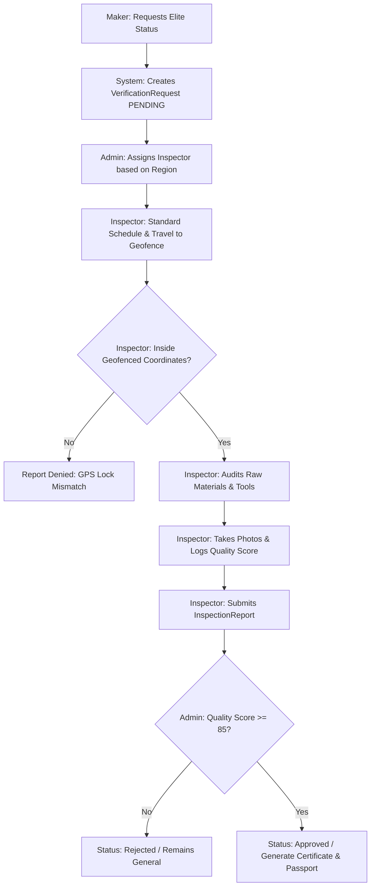
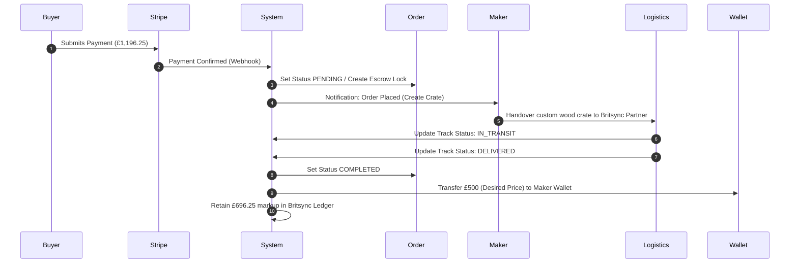

# 📋 Britsync Product Requirements Document (PRD)

---

## 1. Document Control & Role-Based Access Control (RBAC)

### 1.1 Document Metadata
* **Status:** Draft / Ready for Engineering Review
* **Target Release:** v1.0.0-Beta
* **Author:** Britsync Product Management & Architecture Office

### 1.2 System Roles & Permissions Matrix
Britsync enforces a strict Role-Based Access Control (RBAC) schema. The following matrix defines what each user role is permitted to perform across database entities and API routes:

| Role | Public Pages | Custom Dashboards | Product Entity Access | Verification Entity Access | Order Entity Access | Wallet & Payments | Support Tickets |
| :--- | :--- | :--- | :--- | :--- | :--- | :--- | :--- |
| **SUPER_ADMIN / CEO** | Read | `/dashboard/ceo`, `/dashboard/admin` | Full CRUD | Full CRUD (Approve/Revoke) | View, Refund | View, Override Rules | View, Resolve |
| **ADMIN** | Read | `/dashboard/admin` | Full CRUD | Full CRUD | View, Process | View Only | View, Assign, Resolve |
| **INSPECTOR** | Read | `/dashboard/inspector` | Read Only | CRUD (Inspection Reports only) | View assigned only | None | None |
| **MAKER** | Read | `/dashboard/maker` | CRUD (Own products only) | Request Verification | Read (Own products' order items) | View balance, request payout | Create, read own |
| **BUYER** | Read | `/dashboard/buyer` | Read Only | View Certificates/Passports | CRUD (Own orders only) | Stripe pay, view escrow | Create, read own |

---

## 2. Core Workflows & User Journeys

### 2.1 The Elite Verification Journey
This flowchart maps the strict on-site physical auditing flow for transitioning a Maker's product to the "Atelier Elite" tier:



#### Acceptance Criteria
1. The inspector’s GPS coordinates must fall within the workshop geofence registered in `MakerProfile`. A variance of up to 100 meters is allowed for remote regions.
2. The `InspectionReport` must contain a minimum of 3 gallery photos demonstrating traditional tools.
3. Once approved, the product’s `verificationStatus` automatically upgrades from `GENERAL` to `ELITE` (or `GI` if appellation documents are verified).
4. System automatically sends an in-app and email notification to the Maker.

---

### 2.2 The Escrow Payment & Order Fulfillment Cycle



#### Acceptance Criteria
1. The buyer's payment is held in an internal escrow ledger.
2. The Maker receives a shipping notification but is **never** shown the buyer's private address or contact details.
3. Shipping labels are pre-generated by the Britsync Admin panel.
4. Payout to the Maker's wallet is held in `PENDING` state until 48 hours post-delivery verification to allow for buyer disputes.

---

## 3. Page-by-Page Functional Specifications

### 3.1 Public Home Page (`/`)
* **Purpose:** The emotional entry point. Showcases Britsync's mission and provides paths to shop by region and curation tier.
* **UI Components:**
  * **Main Navigation:** Logo, search bar, links to Stories, Passport verification, Cart, and Dashboard/Login.
  * **Interactive Brand Journey (Carousel):** Immersive sliding media showing active workshops.
  * **Curation Tier Cards:** Comparative breakdown (General vs. Atelier Elite vs. GI certified).
  * **Global Craft Appellations (Grid):** Maps origins (Pakistan, Morocco, India, Turkey, Vietnam, etc.).
* **Action Elements & Buttons:**
  * `Explore Atelier Elite` -> Redirects to `/search?tier=elite`.
  * `Explore Maker Biographies` -> Redirects to `/stories`.
  * Appellation Flags -> Redirects to `/search?country=[CountryName]`.
* **State Management:**
  * *Loading:* Skeleton grids for featured products.
  * *Error:* Default fallback categories displayed in case of SQLite connection lag.

---

### 3.2 Product Search & Live Filter Page (`/search`)
* **Purpose:** Multi-parameter search interface allowing buyers to filter down to verified, hand-inspected crafts.
* **Filter Inputs:**
  * Search Keyword (Text input with auto-suggest).
  * Curation Tier (`GENERAL`, `ELITE`, `GI`).
  * Origin Country (Dropdown).
  * Categories (Checkbox group).
  * Attributes: Eco-friendly, Women-led, Handmade (Checkboxes).
  * Price Range Slider.
* **Page Logic & Validations:**
  * Query parameters dynamically update the URL (e.g., `/search?tier=elite&country=Morocco`) to support bookmarking.
  * Input keyword is sanitized against HTML script injection.
* **API/Database Hook:**
  * Calls `GET /api/products` with query params, executing a structured Prisma `findMany` request with category and maker joins.

---

### 3.3 Product Details Page (`/products/[id]`)
* **Purpose:** High-fidelity presentation of a single masterwork, highlighting its materials, dimensions, and provenance passport.
* **UI Components:**
  * **Image Slider:** Displays up to 6 professional photos of the product and workshop.
  * **Provenance Passport Panel:** Tabs containing:
    1. *Specifications:* Materials percentage, village of origin, dimensions.
    2. *Inspection Audit Log:* Field inspector name, audit date, quality score, and GPS geofence confirmations.
    3. *Artisan Story:* Fatima’s biography excerpt, years in business.
  * **Acquisition Card:** Dynamic pricing breakdown (final selling price calculated with vat/shipping), inventory count, and add-to-cart button.
* **Actions:**
  * `Add to Cart` -> Appends product to cart context, opens slide-out drawer.
  * `Save Maker` -> Adds artisan profile to Buyer's saved list (authenticated check required).
* **Validation Rules:**
  * Disable `Add to Cart` if `inventory <= 0`. Show "Acquired / Out of Stock".

---

### 3.4 Cryptographic Passport Registry (`/passport`)
* **Purpose:** The public validation registry. Allows patrons to verify the authenticity of their physical certificates or NFC tags.
* **UI Components:**
  * Search bar requesting the unique `Passport ID` or QR hash code.
  * Successful Match Dashboard: Displays complete SHA-256 digital signature hashes, geofence coordinates, lead inspector names, and quality score.
* **Error States:**
  * If ID is not found, show: *"Warning: This passport ID is not registered in the Britsync Curation Index. Please contact authenticity@britsync.com."*

---

### 3.5 CEO Executive Cockpit (`/dashboard/ceo`)
* **Purpose:** Control panel for Britsync founders to inspect gross margins, transaction logs, and override marketplace pricing parameters in real-time.

```
┌────────────────────────────────────────────────────────────────────────┐
│                        BRITSYNC CEO COCKPIT                            │
├───────────────────────────────────┬────────────────────────────────────┤
│       GLOBAL REVENUE STATS        │       ACTIVE PRICING OVERRIDES     │
│   * Gross Volume: £124,500.00     │   * Category Markup:               │
│   * Maker Payouts: £52,000.00     │     - Ceramics: [ 60 ] %           │
│   * Britsync Margin: £72,500.00   │     - Textiles: [ 60 ] %           │
│   * Escrow Pipeline: £18,200.00   │   * Country modifier:              │
│                                   │     - Pakistan: [ +5 ] %           │
├───────────────────────────────────┴────────────────────────────────────┤
│                       DYNAMIC TRANSACTION LOGS                         │
│ [Order ID]   [Maker Payout]   [Britsync Margin]   [Escrow Lock Release]│
│ bs-8932      £350.00          £490.00             24 Hours Left        │
│ bs-8931      £120.00          £180.00             Released             │
└────────────────────────────────────────────────────────────────────────┘
```

* **Actions & Controllers:**
  * Update Category Margin inputs -> Instantly recalculates buyer prices site-wide.
  * Toggle Luxury Threshold parameters (Limit and adjusted margin).
  * Save overrides -> Calls `POST /api/pricing/override` writing to `localStorage` (or database configuration state).

---

### 3.6 Maker Portal (`/dashboard/maker`)
* **Purpose:** Simplified interface for artisans to list products, track orders, and request verification audits.
* **Action Flows:**
  * **Product Publisher Form:**
    * Required fields: Product Name, Description, Desired Payout Price (£), Category, Materials, Dimensions.
    * Photo uploads: Up to 6 images.
  * **Verification Request Launcher:**
    * One-click trigger: "Request Atelier Elite Physical Audit". Creates a `VerificationRequest` record linked to the maker profile.
  * **Wallet & Ledger:**
    * Displays "Current Balance", "Pending Escrow Balance", and transaction list.
    * `Request Payout` -> Prompts bank selection and issues a debit transaction request to Britsync Finance.

---

### 3.7 Inspector Hub (`/dashboard/inspector`)
* **Purpose:** Field workspace for inspectors conducting on-site audits.
* **Form Inputs & Audits:**
  * **Assigned Requests List:** Displays Maker Profiles awaiting audits.
  * **GPS Audit Verification:** Auto-detects device GPS location and verifies if it is within 100 meters of the Maker's workshop location coordinates.
  * **Quality Audit Worksheet:**
    * Quality Score Slider (0 to 100).
    * Core Materials Audit Checklist (100% Organic, Ethically Dyed, Non-Synthetic).
    * Production Method (Traditional Tools Used - Yes/No).
    * Photo Upload (Live camera capture of workshop).
    * Inspector Cryptographic Pin (Generates SHA-256 verification hash).
* **Actions:**
  * `Submit Verification Report` -> Writes to `InspectionReport` DB model and triggers status update evaluations.

---

## 4. Notifications & Alerts Directory

| Trigger Event | Recipient | Delivery Channel | Messaging Template |
| :--- | :--- | :--- | :--- |
| **Order Placed** | Maker | In-App / SMS | *"A collector has acquired your craft [Product Name]! Desired payout of [Price] is locked in escrow. Please package and prepare the custom crate."* |
| **Order Shipped** | Buyer | Email / In-App | *"Your Britsync acquisition is on its way. Track shipping logs here: /dashboard/buyer. Your Provenance Passport has been activated."* |
| **Audit Scheduled** | Maker | In-App / SMS | *"Inspector [Inspector Name] has been assigned to audit your workshop. They will coordinate an on-site visit soon."* |
| **Elite Approved** | Maker | In-App / Email | *"Congratulations! Your workshop has passed on-site inspection. Your verified products now display the Atelier Elite Badge."* |
| **Dispute Opened** | Admin / Maker | Email | *"Action Required: Buyer has opened a dispute for Order [Order ID]. Escrow funds are locked pending review."* |

---

## 5. Non-Functional Requirements & Acceptance Criteria

### 5.1 Performance & Reliability SLAs
1. **First Contentful Paint (FCP):** Under **1.2 seconds** for all public facing pages.
2. **Nova AI Chat response latency:** Stream start within **200ms** (if remote Nova proxy is active), or local fallback database routing completed in under **100ms**.
3. **Database transaction locks:** Escrow ledger entries must use SQLite transaction wrappers (`prisma.$transaction`) to prevent double-spending or duplicate wallet allocations.

### 5.2 Accessibility & Compliance
* **Accessibility Standards:** WCAG 2.1 Level AA compliance.
* **Story Media Alt Texts:** All artisan photography, workshop videos, and product profiles must contain meaningful screen-reader alternatives detailing the human craft process.
* **Security Standards:** Cryptographic sessions are HTTP-only and secured with SameSite flags to prevent Cross-Site Scripting (XSS) and Cross-Site Request Forgery (CSRF). All user inputs processed by the Nova assistant undergo character escaping to prevent prompt injections.
